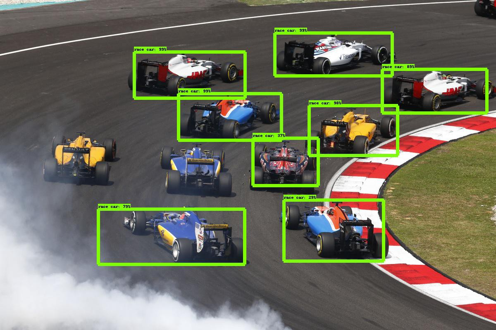
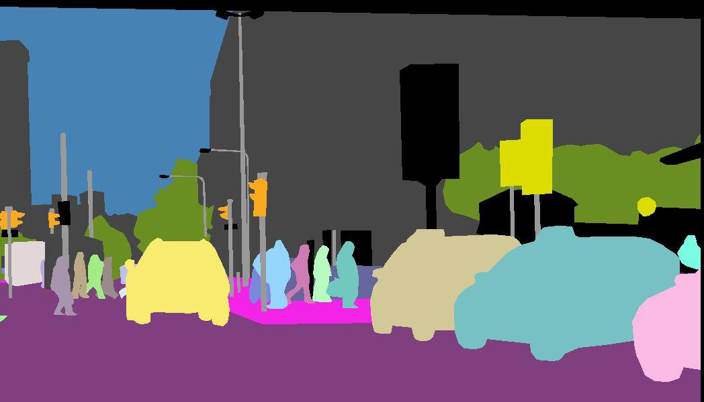

# Visão Computacional para Detecção de Corrosão Externa em Instalações Offshore

* BI MASTER PUC RIO (2020 - TURMA PETROBRAS) GRUPO D5 DO PROGRAMA E&P COMPETÊNCIAS.
* ALUNO: ANDERSON OLIVEIRA DA ROCHA
* MATRÍCULA: 192190080

## Contexto: 

Instalações industriais offshore operam em ambientes com alta exposição a intempéries, nesse ambiente hostil, estruturas metálicas sofrem com a corrosão e acabam por se degradar, comprometendo dessa forma a integridade da unidade e gerando potencial de comprometer a eficiência operacional e a segurança dos trabalhadores. Inspeções periódicas acontecem com o objetivo de identificar ocorrências de corrosão de modo a subsidiar um adequado planejamento e priorização da execução dos serviços de restauração e preservações desses elementos. Contudo, o trabalho de inspecionar periodicamente essas unidades, além é oneroso, consome um HH considerável, além de concorrer por vagas a bordo, um problema constante em uma unidade offshore.

## Proposta:

Considerando o contexto acima descrito, esse projeto tem como objetivo permitir a detecção da corrosão externa por meio de um algoritmo de visão computacional deeplearning que analisa uma fotografia comum e destaca as áreas com corrosão existente. Essa abordagem viabiliza uma triagem em terra com foco em entender as condições gerais da unidade. Essa abordagem tem potencial de reduzir a quantidade de embarques e mesmo a quantidade de HH envolvido no processo de inspeção.

## Abordagem:

Entre as várias técnicas de visão computacional descritas abaixo, a técnica de segmentação por instância foi selecionada para identificação das múltiplas ocorrências de corrosão nas fotos das estruturas metálicas. A técnica de segmentação por instância é uma das técnicas mais avançadas e considerando o problema em questão ela pavimenta a evolução do modelo em uma cenário futuro, considerando que no momento só será feita a detecção, porém se espera evoluir o modelo para identificar o grau de severidade da corrosão, como por exemplo: leve, moderada ou severa.

### * Classificação de Imagens

Na classificação de imagens o objetivo é identificar a qual classe pertence uma determinada imagem, como carros, pessoas, animais, etc.

### * Detecção de Objetos

Na detecção de objetos o objetivo é localizar onde os elementos de interesse (uma determinada classe de interesse) se encontram na imagem, geralmente por meio de uma Bounding Box (caixa) ao redor do mesmo. Se combinada com outras técnicas é possível além de localizar e marcar os elementos na imagem com um Bounding Box também classificar em classes distintas.

### * Rastreamento de Objetos

Rastreamento de objetos é o processo de seguir um ou mais elementos específicos de interesse em uma cena, geralmente utilizado em aplicações com vídeos.

### * Segmentação Semântica

Na segmentação semântica um conjunto de pixels que pertence a uma mesma classe são classificados de forma igual formando uma máscara que delimita as fronteiras do elemento.

### * Segmentação de Instância

Na segmentação por instância os pixels são classificados por semelhança, não somente das classes, mas também por cada instância que pode ser de classes distintas. Uma máscara é criada individualmente para cada instância identificada na cena.

