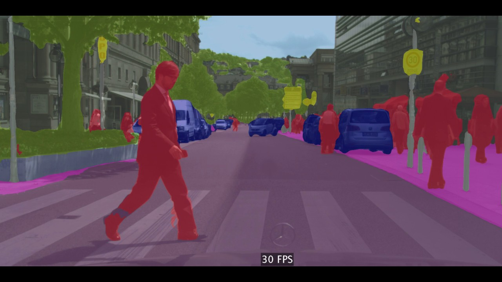
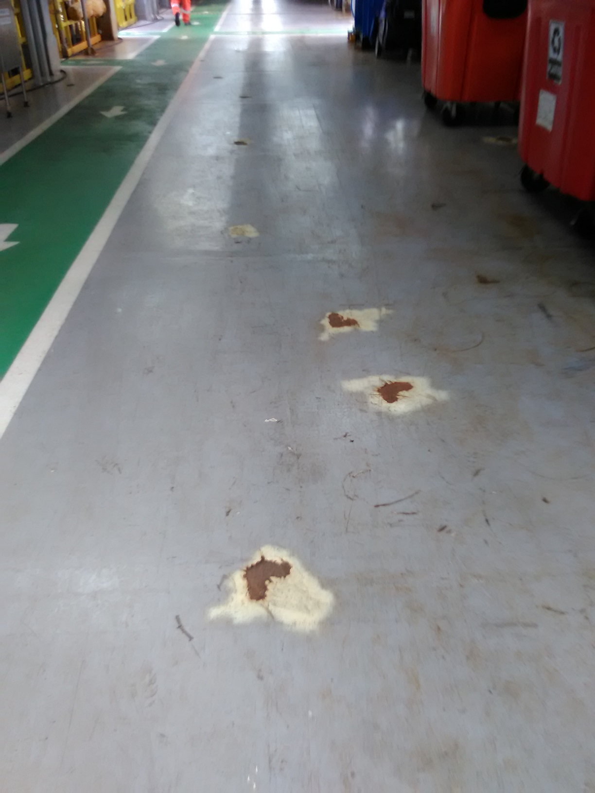
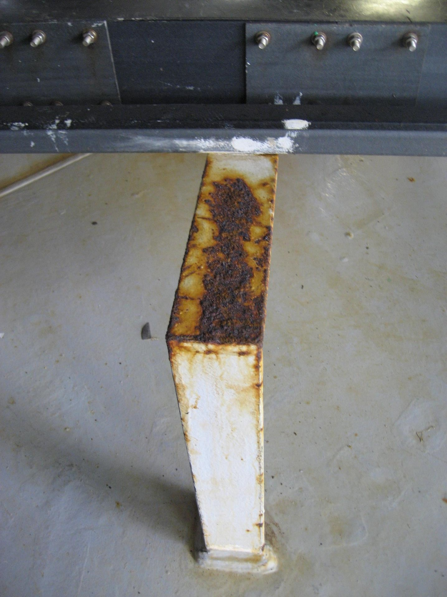
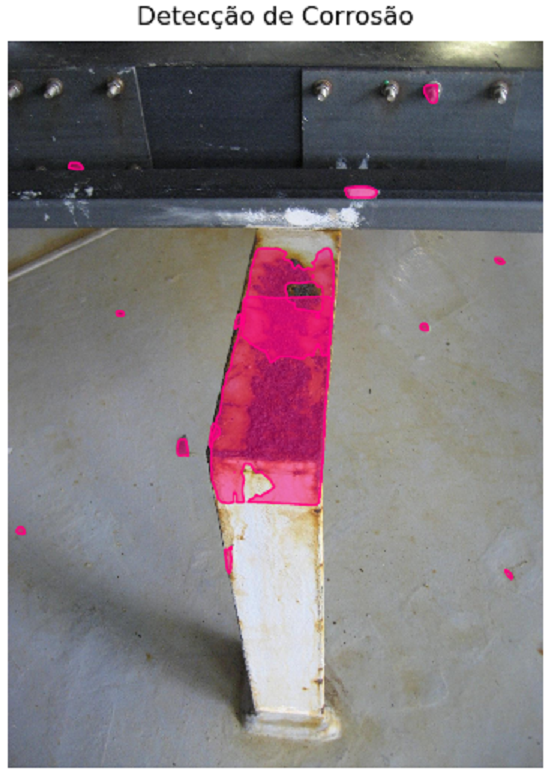
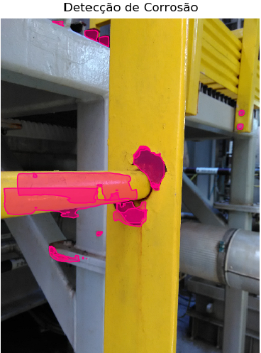

# Visão Computacional para Detecção de Corrosão Externa em Instalações Offshore

* BI MASTER PUC RIO (2020 - TURMA PETROBRAS) GRUPO D5 DO PROGRAMA E&P COMPETÊNCIAS.
* ALUNO: ANDERSON OLIVEIRA DA ROCHA
* MATRÍCULA: 192190080

## Contexto: 

Instalações industriais offshore operam em ambientes com alta exposição a intempéries, nesse ambiente hostil, estruturas metálicas sofrem com a corrosão e acabam por se degradar, comprometendo dessa forma a integridade da unidade e gerando potencial de comprometer a eficiência operacional e a segurança dos trabalhadores. Inspeções periódicas acontecem com o objetivo de identificar ocorrências de corrosão de modo a subsidiar um adequado planejamento e priorização da execução dos serviços de restauração e preservações desses elementos. Contudo, o trabalho de inspecionar periodicamente essas unidades, além é oneroso, consome um HH considerável, além de concorrer por vagas a bordo, um problema constante em uma unidade offshore.

## Proposta:

Considerando o contexto acima descrito, esse projeto tem como objetivo permitir a detecção da corrosão externa por meio de um algoritmo de visão computacional deeplearning que analisa uma fotografia comum e destaca as áreas com corrosão existente. Essa abordagem viabiliza uma triagem em terra com foco em entender as condições gerais da unidade. Essa abordagem tem potencial de reduzir a quantidade de embarques e mesmo a quantidade de HH envolvido no processo de inspeção.

## Abordagem:

Entre as várias técnicas de visão computacional descritas abaixo, a técnica de segmentação por instância foi selecionada para identificação das múltiplas ocorrências de corrosão nas fotos das estruturas metálicas. A técnica de segmentação por instância é uma das técnicas mais avançadas e considerando o problema em questão ela pavimenta a evolução do modelo para um cenário futuro, considerando que no momento só será feita a detecção de ocorrências de corrosão, porém se espera evoluir o modelo para identificar o grau de severidade da corrosão, como por exemplo: leve, moderada ou severa.

### * Classificação de Imagens

Na classificação de imagens o objetivo é identificar a qual classe pertence uma determinada imagem, como carros, pessoas, animais, etc.

### * Detecção de Objetos

Na detecção de objetos o objetivo é localizar onde os elementos de interesse (uma determinada classe de interesse) se encontram na imagem, geralmente por meio de uma Bounding Box (caixa) ao redor do mesmo. Se combinada com outras técnicas é possível além de localizar e marcar os elementos na imagem com um Bounding Box, também classificar em classes distintas.

### * Rastreamento de Objetos

Rastreamento de objetos é o processo de seguir um ou mais elementos específicos de interesse em uma cena, geralmente utilizado em aplicações com vídeos.

### * Segmentação Semântica

Na segmentação semântica um conjunto de pixels que pertence a uma mesma classe são classificados de forma igual formando uma máscara que delimita as fronteiras do elemento.

### * Segmentação por Instância

Na segmentação por instância os pixels são classificados por semelhança, não somente das classes, mas também por cada instância que pode ser de classes distintas. Uma máscara é criada individualmente para cada instância identificada na cena.

Considerando a técnica selecionada para abordar o problema, as pesquisas desse estudo indicaram a rede MASK RCNN como um caminho promissor para obtenção de resultados. Uma implementação da MASK RCNN pode ser encontrada em: https://github.com/matterport/Mask_RCNN e foi utilizada como base desse estudo.

## Desenvolvimento:

Como citado no tópico anterior esse projeto foi desenvolvido com base na rede MASK RCNN, seguem abaixo algumas características técnicas:

* KERAS com BACKEND Tensorflow;
* Rede MASK RCNN com BACKBONE RESNET101;
* Rede pré-treinada com DATASET MS COCO;
* Retreino com DATASET customizado com anotações de segmentação de corrosão, conjunto de treino (TRAIN) com 100 imagens e conjunto de validação (VAL) com 30 imagens;
* Anotações realizadas com o VGG Image Annotator (VIA) e anotações exportadas como JSON (DATASET.JSON);
* Treino realizado em GPU NVIDIA 940MX com CUDA 9.0 e CUDNN64_7.dll;
* Predição realizada em CPU;
* Requisitos importantes de versão: tensorflow==1.5.1; keras==2.1.0; tensorflow-gpu==1.5.1;h5py==2.10.0;
* Os pesos MS COCO e CORROSION, respectivamente para retreinar o modelo e realizar predições, encontram-se compactados na pasta **WEIGHT** e precisam ser descompactados para execução do projeto;

A estrutura de pastas do projeto encontra-se disposta da seguinte forma:

* Pasta **CUSTOM**: Contém os arquivos **custom.py** e **predict.py**, respectivamente para fazer o treinamento do modelo e a predição com a detecção da corrosão. Para treinar o modelo e gerar novos pesos deve-se usar o seguinte comando: **"python custom.py train --dataset=../dataset --weights=coco"**, os novos pesos gerados estarão na SUBPASTA de sessão localizada na pasta **WEIGHT** na raiz do projeto.  
Para predição, uma imagem simples precisa ser copiada para pasta **CUSTOM** e deve ter o nome: **Corrosao.jpg**, posteriormente deve ser executado o comando **pyhton predict.py**. Ainda na pasta CUSTOM existe uma SUBPASTA chamada RESULTADOS onde algumas predições estão salvas para efeito de demonstração, como segue:

