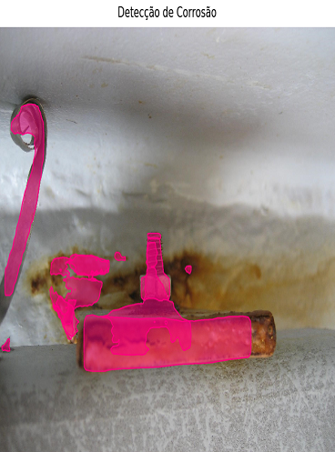
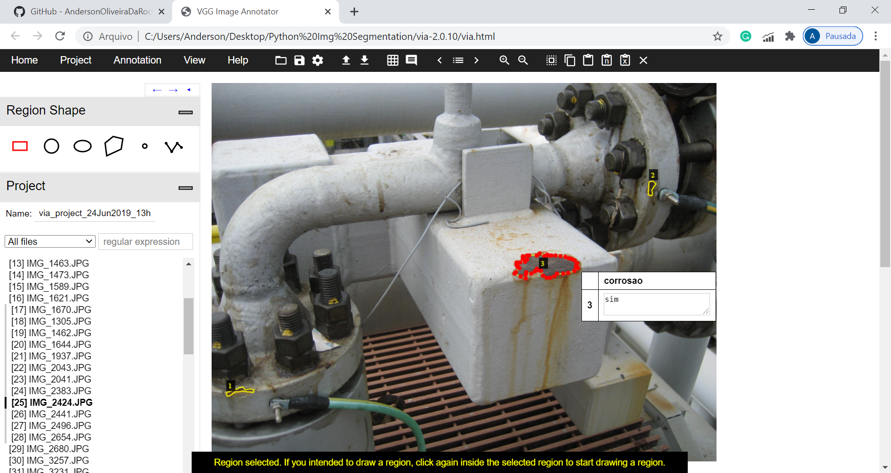

# Visão Computacional para Detecção de Corrosão Externa em Instalações Offshore

#### Aluno: [Anderson Oliveira da Rocha](https://github.com/AndersonOliveiraDaRocha)
#### Orientador: Leonardo Mendonza

---

Trabalho apresentado ao curso [BI MASTER](https://ica.puc-rio.ai/bi-master) como pré-requisito para conclusão de curso e obtenção de crédito na disciplina "Projetos de Sistemas Inteligentes de Apoio à Decisão".

- [Link para o código](https://github.com/AndersonOliveiraDaRocha/BiMasterPucRio). <!-- caso não aplicável, remover esta linha -->

---

## Resumo

<!-- trocar o texto abaixo pelo resumo do trabalho -->

## Contexto: 

Instalações industriais offshore operam em ambientes com alta exposição a intempéries, nesse ambiente hostil estruturas metálicas sofrem com a corrosão e acabam por se degradar, comprometendo dessa forma a integridade da unidade e gerando potencial de impactar na eficiência operacional e na segurança dos trabalhadores. Inspeções periódicas acontecem com o objetivo de identificar as ocorrências de corrosão de modo a subsidiar um adequado planejamento e priorização para execução dos serviços de restauração e preservação desses elementos. Contudo, o trabalho de inspecionar periodicamente essas unidades é oneroso, consome um HH considerável, além de concorrer por vagas a bordo, o que é um ponto de atenção constante nas operações offshore.

## Proposta:

Considerando o contexto acima descrito, esse projeto tem como objetivo permitir a detecção da corrosão externa por meio de um algoritmo de visão computacional deeplearning que analisa uma fotografia comum e destaca as áreas com corrosão existente. Essa abordagem viabiliza uma triagem em terra com foco em entender as condições gerais da unidade. Essa abordagem tem potencial de reduzir a quantidade de embarques e mesmo a quantidade de HH envolvido no processo de inspeção.

## Abordagem:

Entre as várias técnicas de visão computacional descritas abaixo, a técnica de segmentação por instância foi selecionada para identificação das múltiplas ocorrências de corrosão nas fotos dos componentes metálicos na unidade offshore. A técnica de segmentação por instância é uma das técnicas mais avançadas e considerando o problema em questão pavimenta o caminho para evolução do modelo em um cenário futuro, considerando que no momento será feita apenas a detecção das ocorrências de corrosão, porém, se espera evoluir o modelo para identificar outras informações pertinentes ao processo de inpeção de corrosão externa, por exemplo: O tipo de distribuição da corrosão, o percentual de corrosão mediante a norma, entre outras informações.

### * Classificação de Imagens

Na classificação de imagens o objetivo é identificar a qual classe pertence uma determinada imagem, como carros, pessoas, animais, etc.

### * Detecção de Objetos

Na detecção de objetos o objetivo é localizar onde os elementos de interesse (uma determinada classe de interesse) se encontram na imagem, geralmente por meio de uma Bounding Box (caixa) ao redor do mesmo. Se combinada com outras técnicas é possível além de localizar e marcar os elementos na imagem com um Bounding Box, classificar também em classes distintas.

### * Rastreamento de Objetos

Rastreamento de objetos é o processo de seguir um ou mais elementos específicos de interesse em uma cena, geralmente utilizado em aplicações com vídeos.

### * Segmentação Semântica

Na segmentação semântica um conjunto de pixels que pertence a uma mesma classe são classificados de forma igual formando uma máscara que delimita as fronteiras do elemento.

### * Segmentação por Instância

Na segmentação por instância os pixels são classificados por semelhança, não somente das classes, mas também por cada instância que pode ser de classes distintas. Uma máscara é criada individualmente para cada instância identificada na cena.

Considerando a técnica selecionada para abordar o problema, as pesquisas desse estudo indicaram a rede MASK R-CNN como um caminho promissor para obtenção de resultados. Uma implementação da MASK R-CNN pode ser encontrada em: https://github.com/matterport/Mask_RCNN e foi utilizada como base desse estudo e desenvolvimento do projeto.

## Características:

Como citado no tópico anterior esse projeto foi desenvolvido com base na rede MASK R-CNN, seguem abaixo algumas características técnicas:

* KERAS com BACKEND Tensorflow;
* Rede MASK R-CNN com BACKBONE RESNET101;
* Rede pré-treinada com DATASET MS COCO;
* Retreino com DATASET customizado com anotações de segmentação de corrosão, conjunto de treino (TRAIN) com 100 imagens e conjunto de validação (VAL) com 30 imagens;
* Anotações realizadas com o VGG Image Annotator (VIA) e anotações exportadas como JSON (DATASET.JSON);
* Treino realizado em GPU NVIDIA 940MX com CUDA 9.0 e CUDNN64_7.dll;
* Predição realizada em CPU;
* Requisitos importantes de versão: tensorflow==1.5.1; keras==2.1.0; tensorflow-gpu==1.5.1;h5py==2.10.0;
* Os pesos MS COCO e CORROSION, respectivamente para retreinar o modelo e realizar predições, encontram-se compactados na pasta **WEIGHT** e precisam ser descompactados para execução do projeto;

A estrutura de pastas do projeto encontra-se disposta da seguinte forma:

* Pasta **CUSTOM**: Contém os arquivos **custom.py** e **predict.py**, respectivamente para fazer o treinamento do modelo e a predição com a detecção da corrosão. Para treinar o modelo e gerar novos pesos deve-se usar o seguinte comando: **"python custom.py train --dataset=../dataset --weights=coco"**, os novos pesos gerados estarão na SUBPASTA de sessão localizada na pasta **WEIGHT** na raiz do projeto.  
Para predição, uma imagem simples precisa ser copiada para pasta **CUSTOM** e deve ter o nome: **Corrosao.jpg**, posteriormente deve ser executado o comando **pyhton predict.py**. Ainda na pasta CUSTOM existe uma SUBPASTA chamada RESULTADOS onde algumas predições estão salvas para efeito de demonstração, como segue:

* Pasta **DATASET**: Hospeda os conjuntos de dados utilizados para treinar o modelo, DATASET de Treino (**TRAIN**) e DATASET de validação (**VAL**). As anotações foram feitas no VIA e os resultados exportados no formato JSON como já explicado anteriormente. Para um modelo com maior precisão é necessário um volume de dados de treinamento mais expressivo, porém, não houve disponibilidade para o exercício desse projeto.

* Pasta **mrcnn**: Hospeda o núcleo do modelo MASK R-CNN.

* Pasta **WEIGHT**: Estão armazenados os pesos. Primeiro existe o peso **COCO_WEIGHT.h5** que é o peso do DATASET MS COCO, usado como base para estender o projeto, depois os pesos treinados na detecção de corrosão que está salvo com o nome de **CORROSION.h5**. Caso o modelo seja novamente treinado serão geradas novas pastas de sessão na raiz da pasta WEIGHT e os novos pesos treinados serão criados dentro dessas pastas de sessão, cada época vai gerar um peso. Importante descompactar os pesos antes da execução do projeto!

## Desenvolvimento:

O desenvolvimento do projeto teve como principais fases:

**1.** Autorização do corpo gerencial da cia. (PETROBRAS) para propor a temática de detecção de corrosão por visão computacional e acesso às fontes de dados;  
**2.** Análise das fontes de dados para o treino do modelo (DATASET);  
**3.** Complementação de anotações e tratamento de imagens (Giro de imagens por exemplo para enquadramento na anotação);  
**4.** Pesquisa com foco em identificar uma abordagem técnica para segmentação de imagens por instância;  
**5.** Análise do modelo MASK R-CNN, entendimento do código fonte, implementações e ajustes necessários para adaptar ao problema de detecção de corrosão;  
**6.** Configuração de ambiente com os pacotes corretos das bibliotecas envolvidas;  
**7.** Ajustes para execução dos processamentos em GPU;  
**8.** Treino do modelo para o novo problema de detecção de corrosão externa;  
**9.** Ajuste de parâmetros (épocas, passos, leaning rate, entre outros) para buscar os melhores resultados nas métricas de loss;  
**10.** Predições com imagem nunca antes vistas pelo modelo;  
**11.** Predições também com imagens envolvidas nos conjuntos de treino e validação;  
**12.** Refactoring eliminando funções desnecessárias ao objetivo proposto;  
**13.** Upload do projeto para o GITHUB;  
**14.** Documentação do projeto;  

## Desenvolvimento Técnico:

As implementações e ajustes descritos no item 5 do tópico anterior ocorreram majoritariamente nos arquivos  **custom.py** e **predict.py** onde o código fonte encontra-se comentado para facilitar entendimento e eventuais necessidades de manutenção.  
  
O modelo foi treinado considerando alguns parâmetros:  
  
LEARNING_RATE = 0.001 **(taxa de aprendizado)**    
EPOCHS=20 **(épocas)**  
LAYERS='heads' **(limitado aos heads por conta da GPU disponível para o projeto)**  
STEPS_PER_EPOCH = 20 **(passos por época)**    
DETECTION_MIN_CONFIDENCE = 0.8 **(grau de confiança mínimo no treinamento)**  

O modelo também foi reprojetado para considerar apenas 2 classes: O BACKGROUND (padrão na implementação MASK R-CNN) e a CLASSE ALVO, no caso CORROSAO = SIM, conforme anotação ilustrada abaixo no VIA:  

Para fins de validação da abordagem técnica do projeto, foi fixado (**CORROSAO.JPG**) o nome da imagem esperada para a predição, porém, o projeto abre muitas oportunidades de melhoria e essa é uma delas, não fixar o input.

## Próximos Passos:

Além da análise da fotografia para detecção da presença de corrosão as segmentando, existem outras necessidades de informações que subsidiam o trabalho do inspetor. Informações como o tipo de distribuição da corrosão, os sistemas afetados (flanges, guarda-corpos, tubulações, Suportes, etc.), o grau de corrosão mediante a norma ASTM D-610, são outras informações necessárias e que completam o trabalho do inspetor.  

O resultado mais completo considerando a evolução do modelo, ou mesmo a combinação de outras técnicas de visão computacional, teria a seguinte aparência:

## Conclusão:

A visão computacional em suporte ao trabalho do inspetor de corrosão externa apresenta um grande potencial de otimizar o HH empregado nessa atividade, além de diminuir a subjetividade da análise, uma vez que um inspetor pode ter uma percepção distinta de outro inspetor acerca das condições da instalação, por mais que a norma ASTM-D610 (a norma possui imagens com amostras dos graus de corrosão para serem utilizados como referência) atue como parâmetro de referência. Pode até mesmo reduzir o número de embarques necessários para esse tipo de serviço, visto que as imagens podem ser coletadas por meio de outros recursos ou colaboradores a bordo e posteriormente analisadas em terra.  
O rede MASK R-CNN mostrou grande potencial de segmentar instâncias, porém, resta configurado a necessidade de analisar outras técnicas de visão computacional para completar os objetivos futuros desse trabalho, fazendo uma combinação desses resultados. Além do grande esfoço necessário para gerar um DATASET que consiga treinar um modelo com essa proposta.

## Citações:

**matterport_maskrcnn_2017**,  
**title**=Mask R-CNN for object detection and instance segmentation on Keras and TensorFlow,    
**author**=Waleed Abdulla,  
**year**=2017,    
**publisher**=Github,  
**journal**=GitHub repository,  
**howpublished**=https://github.com/matterport/Mask_RCNN  

---

Matrícula: 192.190.080

Pontifícia Universidade Católica do Rio de Janeiro

Curso de Pós Graduação *Business Intelligence Master*
